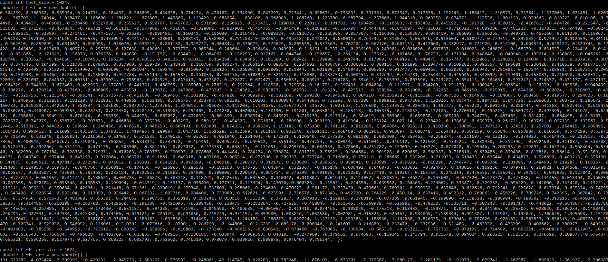
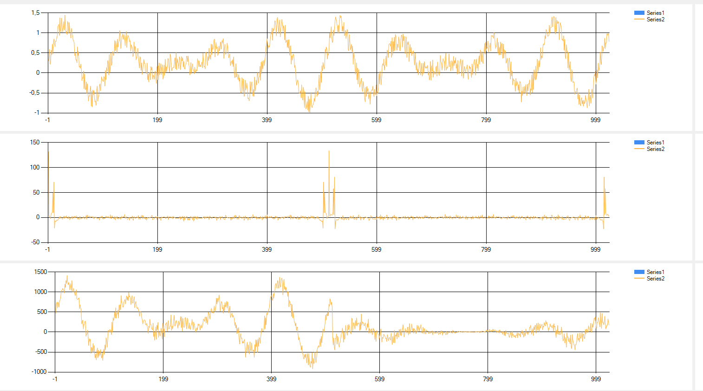

# Conceptual Design, What is FFT

FFT stands for Fast Fourier Transform, and it is a mathematical algorithm used for analyzing the frequency components of a signal or time-domain data. FFT is a fast and efficient way to perform a Discrete Fourier Transform (DFT), which is a mathematical technique that converts a signal from its original domain (typically time or space) to the frequency domain.

Here are some key points about FFT and its applications:

Frequency Analysis: FFT is used to analyze the frequency components of a signal. It decomposes a signal into its constituent frequencies, making it useful in applications where understanding the frequency content of a signal is important.

Audio and Signal Processing: FFT is widely used in audio processing, such as music analysis, speech recognition, and audio compression. It helps in tasks like identifying musical notes, filtering noise, or performing spectral analysis.

Image Processing: In image processing, FFT is used for tasks like image compression, pattern recognition, and filtering operations. For example, FFT can be used in edge detection or image enhancement.

Communication Systems: In communication systems, FFT is used for modulation, demodulation, and channel equalization. It helps to analyze and manipulate signals in the frequency domain, which is crucial for efficient data transmission.

Vibration Analysis: In mechanical engineering and structural analysis, FFT is used to study vibrations and resonances. It can help identify mechanical issues or structural weaknesses in machinery and buildings.

Scientific Research: FFT is an essential tool in various scientific fields, including physics, chemistry, and geophysics. It is used to analyze experimental data, study the spectral content of physical phenomena, and extract information from measurements.

Financial Analysis: In finance, FFT can be used for tasks like time-series analysis and financial forecasting. It can help identify cyclic patterns and fluctuations in market data.

Biomedical Signal Processing: In healthcare, FFT is used for analyzing biomedical signals, such as electroencephalograms (EEG), electrocardiograms (ECG), and other physiological data. It aids in diagnosing medical conditions and monitoring health.

Speech Recognition: FFT is a key component of speech recognition systems, helping to extract the frequency components of speech signals, making it easier to recognize spoken words.

FFT is a fundamental tool for understanding the frequency characteristics of signals in various domains. Its applications are widespread, and it plays a crucial role in scientific research, engineering, and technology.

# Project Compilation result

# For visualization I used Chart chart for C# Form Project

fft and i fft out:

C# visualization Code:

using System;
using System.Windows.Forms;
using System; 
using System.Windows.Forms.DataVisualization.Charting;
 

namespace signal_processing
{ 
    public partial class Form1 : Form
    { 
        Series series_1;
        Series series_2;
        Series series_3;
         
        public void graph_writer(Chart chart, Series series , double[] Array , int SIZE)
        {

            int count = 0;

            for (int k = 0; k < SIZE; k++)
            {
                series.Points.AddXY(count++, Array[k]); 
            }

            chart.Series.Add(series);
            chart.Invalidate(); 

        }
         
        public Form1()
        {
            InitializeComponent();
           
            series_1 = new Series();
            series_1.ChartType = SeriesChartType.Line;
            series_2 = new Series();
            series_2.ChartType = SeriesChartType.Line;
            series_3 = new Series();
            series_3.ChartType = SeriesChartType.Line;

            graph_writer(chart1 , series_1 , test_x , test_size);
              
            graph_writer(chart2, series_2, fft_arr, fft_arr_size);

            graph_writer(chart3, series_3, ifft_arr, ifft_arr_size);

        }

        const int test_size = 1024;
        double[] test_x = new double[] {
0.304239, 0.366382, 0.585954, 0.214731, 0.284437, 0.566095, 0.454038, 0.714274, 0.476107, 0.734990, 0.847797, 0.723441, 0.658671, 0.795833, 0.791381, 0.872547, 0.917838, 1.152245, 1.188413, 1.210579, 0.937641, 1.377060, 1.071481, 1.020908, 1.367709, 1.174914, 1.028437, 1.106600, 1.281021, 1.072307, 1.445805, 1.123429, 0.988254, 1.038100, 0.960089, 1.288760, 1.223780, 0.987794, 1.257660, 1.044318, 0.969358, 0.874372, 1.113550, 1.001123, 0.930965, 0.819223, 0.810188, 0.744496, 0.434437, 0.486001, 0.326460, 0.327658, 0.255627, 0.650797, 0.437823, 0.531690, 0.150625, 0.171431, 0.118039, 0.220117, 0.101782, -0.190429, -0.116593, -0.133432, 0.045192, -0.391728, -0.030026, -0.416781, -0.404726, -0.221547, -0.515685, -0.271505, -0.467854, -0.702721, -0.581121, -0.577960, -0.432678, -0.328092, -0.827902, -0.454755, -0.846469, -0.428829, -0.535708, -0.444788, -0.645697, -0.721032, -0.710322, -0.809330, -0.461223, -0.327831, -0.704492, -0.602412, -0.582531, -0.323997, -0.271461, -0.447157, -0.315203, -0.099496, -0.160341, -0.186030, -0.216446, -0.089324, -0.112675, -0.326865, 0.057307, -0.166305, 0.130297, 0.043419, 0.306092, 0.256265, -0.049731, 0.455360, 0.011239, 0.115067, 0.495123, 0.192140, 0.244610, 0.533555, 0.483094, 0.441376, 0.528001, 0.808131, 0.558902, 0.791288, 0.658454, 0.496718, 0.842022, 0.650011, 0.764742, 0.813022, 1.057946, 0.915603, 0.610972, 0.779312, 0.892832, 0.974927, 0.912659, 0.841168, 0.962510, 0.859899, 0.681007, 0.896995, 1.036070, 0.638715, 0.861158, 0.945727, 0.904844, 0.870675, 0.779629, 0.805555, 0.537569, 0.702202, 0.667120, 0.607131, 0.412060, 0.432917, 0.771926, 0.514100, 0.664323, 0.629122, 0.329745, 0.374428, 0.445489, 0.613470, 0.405712, 0.255358, 0.127638, 0.408691, 0.373777, 0.065344, 0.248664, -0.036494, 0.049902, 0.216151, 0.337143, 0.239103, 0.243901, 0.028026, 0.007837, -0.016023, 0.246079, -0.168570, -0.031537, -0.224416, 0.014191, -0.031866, -0.171929, 0.156873, 0.076276, 0.145050, -0.151757, -0.054451, -0.084967, -0.156295, 0.027167, 0.044746, -0.150657, -0.261134, 0.157512, -0.167466, 0.178733, -0.171204, 0.248640, -0.040948, 0.105914, 0.230885, -0.046262, 0.128748, 0.203627, -0.154658, -0.107453, 0.196334, -0.059051, 0.340336, 0.010113, 0.154264, 0.034685, 0.161300, 0.362422, 0.339896, 0.141744, 0.017980, 0.469192, 0.440475, 0.157747, 0.051965, 0.124821, 0.124034, 0.137718, 0.137930, 0.307779, 0.374345, 0.104399, 0.521731, 0.079085, 0.357908, 0.259729, 0.248461, 0.110769, 0.401274, 0.365159, 0.083542, 0.234592, 0.406789, 0.306582, 0.380116, 0.151895, 0.284779, 0.109282, 0.095557, 0.195081, 0.230420, 0.418638, 0.410771, 0.281543, 0.423498, 0.212254, 0.154902, -0.049600, -0.021044, 0.259248, -0.011099, 0.123126, 0.226830, 0.092005, 0.051044, -0.021899, 0.149043, 0.006589, 0.017475, 0.080465, 0.052020, 0.356943, 0.281081, 0.157244, 0.302551, 0.158751, 0.201528, 0.158948, 0.205466, 0.268699, 0.130090, 0.497788, 0.351142, 0.154587, 0.161853, 0.103476, 0.510899, 0.521917, 0.318808, 0.187253, 0.408451, 0.312699, 0.616781, 0.354321, 0.445645, 0.342099, 0.719401, 0.455881, 0.710398, 0.588312, 0.632039, 0.821007, 0.844982, 0.401511, 0.639074, 0.758965, 0.602925, 0.647413, 0.437387, 0.472827, 0.672477, 0.550853, 0.669231, 0.774705, 0.594613, 0.755392, 0.807596, 0.743287, 0.854115, 0.364031, 0.597247, 0.714357, 0.471177, 0.477197, 0.504329, 0.744933, 0.672463, 0.492995, 0.377893, 0.441351, 0.468795, 0.185960, 0.276319, 0.292364, 0.218550, 0.329554, 0.161751, 0.397431, 0.004034, -0.121997, -0.084200, 0.231178, -0.100347, -0.026542, -0.120530, -0.165538, -0.040439, -0.206276, -0.129314, -0.427160, -0.496805, -0.493551, -0.117672, -0.147086, -0.473303, -0.154562, -0.585877, -0.562732, -0.181528, -0.425512, -0.358564, -0.251000, -0.392963, -0.645150, -0.625915, -0.694366, -0.680824, -0.218607, -0.491473, -0.325756, -0.223140, -0.396341, -0.573677, -0.412686, -0.589456, -0.102815, -0.457828, -0.389292, -0.182280, -0.299320, -0.045382, 0.004210, -0.255938, -0.115128, -0.097526, 0.164935, -0.184007, 0.268458, -0.019677, 0.294823, 0.102267, 0.246952, 0.315856, 0.182220, 0.332932, 0.449969, 0.662496, 0.738675, 0.853797, 0.692392, 0.610103, 0.680984, 0.644305, 0.735292, 0.867208, 0.999812, 0.977206, 1.122026, 0.817447, 1.104722, 1.047725, 1.105063, 1.303712, 1.286672, 1.150733, 0.929289, 1.342669, 1.388534, 1.233689, 0.987297, 1.223206, 1.324015, 0.903633, 1.112203, 1.191635, 1.335779, 1.216326, 1.023667, 1.176590, 1.133352, 0.825486, 1.192773, 0.757222, 0.801278, 0.820444, 0.641268, 0.827416, 0.618425, 0.830289, 0.440907, 0.659255, 0.678751, 0.222450, 0.428479, 0.318905, 0.454405, 0.474230, 0.402086, 0.138190, 0.191801, 0.045047, -0.185418, -0.305335, -0.218852, -0.172186, -0.270518, -0.496225, -0.509717, -0.492499, -0.444678, -0.624112, -0.296662, -0.594919, -0.676144, -0.358359, -0.444978, -0.865052, -0.472033, -0.801499, -0.898974, -0.845927, -0.715139, -0.917926, -0.584619, -0.969081, -0.659838, -0.985238, -0.744773, -0.487463, -0.821407, -0.864498, -0.816167, -0.782577, -0.743079, -0.636723, -0.707673, -0.466881, -0.375336, -0.402257, -0.589155, -0.454325, -0.551638, -0.289900, -0.050199, -0.419994, -0.295124, 0.027114, -0.238422, 0.178638, 0.059373, 0.261721, 0.163761, 0.097135, 0.193563, 0.592940, 0.513811, 0.644523, 0.599924, 0.348466, 0.476528, 0.446253, 0.607191, 0.993001, 0.874351, 0.958534, 1.153183, 0.875130, 0.761110, 0.811286, 1.069864, 0.936311, 1.110330, 1.308661, 1.397123, 1.334563, 1.257902, 1.164415, 0.989895, 1.186410, 0.990412, 1.301009, 1.435197, 1.379831, 1.419485, 1.289807, 1.043710, 1.161528, 1.032399, 1.261161, 0.932548, 0.951611, 1.060468, 0.861961, 0.963897, 1.088748, 1.054713, 0.589159, 0.555846, 0.958984, 0.810539, 0.577298, 0.630711, 0.711490, 0.531249, 0.668054, 0.216603, 0.514067, 0.371535, 0.340125, -0.032023, 0.051940, 0.251404, -0.172281, 0.120540, -0.277239, 0.081180, 0.005409, -0.353462, -0.268874, -0.211607, -0.132126, -0.374023, -0.464471, -0.212913, -0.317365, -0.400942, -0.648767, -0.719846, -0.356252, -0.583814, -0.337972, -0.464451, -0.395232, -0.649512, -0.556135, -0.473224, -0.780914, -0.511041, -0.446112, -0.421534, -0.434222, -0.332430, -0.512396, -0.592460, -0.411087, -0.533788, -0.542439, -0.299266, -0.571219, -0.471135, -0.503500, -0.381230, -0.027072, -0.275351, 0.038111, -0.131651, -0.295166, -0.084533, 0.178600, 0.231787, 0.179099, 0.345775, 0.072070, 0.195646, 0.200293, 0.419897, 0.162724, 0.568464, 0.534340, 0.382930, 0.707184, 0.728338, 0.729971, 0.670203, 0.789775, 0.390993, 0.878800, 0.441484, 0.784274, 0.538874, 0.891715, 0.565231, 0.964684, 0.901928, 0.620065, 0.568387, 0.718610, 0.630486, 0.899436, 0.817810, 0.566141, 0.551389, 0.844371, 0.948345, 0.937404, 0.647193, 0.972064, 0.803702, 0.911861, 0.649918, 0.483106, 0.905514, 0.872706, 0.389337, 0.777746, 0.716089, 0.779218, 0.286865, 0.535206, 0.711033, 0.510435, 0.635448, 0.434873, 0.526650, 0.483215, 0.556190, 0.347075, 0.198523, 0.497817, 0.272547, 0.071812, 0.256302, 0.014182, 0.092390, -0.046618, 0.190777, 0.312171, 0.238820, -0.050636, 0.058641, 0.238599, -0.079639, -0.018290, 0.240747, -0.005368, 0.281095, 0.148498, 0.119287, 0.166267, 0.121405, 0.124053, 0.189753, -0.048760, 0.030011, -0.174036, -0.126906, 0.285532, -0.182268, 0.176735, 0.043943, 0.322367, -0.106179, 0.038492, 0.040073, -0.033032, -0.024713, 0.148616, 0.169250, -0.079701, 0.269921, 0.134568, -0.021405, -0.065577, 0.023587, 0.435981, 0.302462, 0.233184, 0.072352, 0.211903, 0.354000, 0.300805, 0.290149, 0.061714, 0.376399, 0.491915, 0.072350, 0.137410, 0.119267, 0.165754, 0.246314, 0.475555, 0.155642, 0.297917, 0.048835, 0.127042, 0.305377, 0.272619, 0.061952, 0.412747, 0.180621, 0.308725, 0.246878, 0.383118, 0.118791, 0.222536, -0.032582, 0.310042, 0.018807, -0.019417, 0.143052, 0.288819, 0.346277, 0.245602, -0.077520, 0.278778, 0.323088, -0.131458, 0.018364, 0.160253, 0.067355, 0.030284, 0.093748, 0.136553, 0.199094, -0.014319, -0.159137, 0.058496, 0.177311, 0.113394, 0.143070, 0.000326, -0.115631, 0.224556, -0.039552, 0.164463, 0.223062, 0.333473, 0.329732, -0.056229, 0.242000, 0.343420, 0.119221, 0.219311, 0.055213, 0.350684, 0.429361, 0.221418, 0.571361, 0.520019, 0.279348, 0.532800, 0.298062, 0.234609, 0.470923, 0.561172, 0.737430, 0.473663, 0.769302, 0.559952, 0.637840, 0.620616, 0.792241, 0.525028, 0.617974, 0.655334, 0.747950, 0.545408, 0.928554, 0.933104, 0.912050, 0.936442, 0.867232, 1.003716, 0.984406, 0.732989, 0.612621, 0.673591, 0.716570, 0.871343, 0.492720, 0.764229, 0.450114, 0.637419, 0.453312, 0.769863, 0.456726, 0.709726, 0.742395, 0.367642, 0.720535, 0.374960, 0.575573, 0.483388, 0.553301, 0.244652, 0.298751, 0.365810, 0.183241, 0.050518, 0.313200, 0.372837, 0.207918, -0.152816, 0.278819, -0.077339, 0.051846, -0.299890, -0.138518, -0.186994, -0.180302, -0.313216, -0.460346, -0.138535, -0.314485, -0.210298, -0.263708, -0.429560, -0.291338, -0.491096, -0.208450, -0.230475, -0.282864, -0.727525, -0.458046, -0.561545, -0.350938, -0.526992, -0.478233, -0.335711, -0.507243, -0.291717, -0.448022, -0.564867, -0.283786, -0.445666, -0.267086, -0.275635, -0.173430, -0.551157, -0.394238, -0.431992, -0.049698, -0.486638, -0.001057, -0.411418, 0.074466, -0.108029, -0.175318, 0.168432, -0.159871, -0.064879, 0.341605, 0.225706, 0.028029, 0.306233, 0.148840, 0.296294, 0.627531, 0.339334, 0.427388, 0.374406, 0.629121, 0.726129, 0.694036, 0.715229, 0.931452, 0.859980, 1.083846, 1.052586, 1.002981, 0.915523, 0.926463, 0.934869, 1.189344, 0.991587, 1.131983, 1.132026, 1.306625, 1.395698, 1.151886, 1.317047, 1.411443, 1.398123, 1.030787, 0.974781, 1.388183, 1.033850, 1.314455, 1.241359, 1.244188, 1.280227, 0.829724, 1.127122, 1.253383, 1.188536, 1.102080, 0.826535, 0.839043, 0.797820, 0.926183, 0.567839, 0.836313, 0.408770, 0.355470, 0.705741, 0.525032, 0.546052, 0.126061, 0.510302, 0.073616, 0.187001, 0.280799, -0.144808, -0.215235, 0.085170, 0.008946, -0.241607, -0.216809, -0.233470, -0.532536, -0.521483, -0.463332, -0.473309, -0.400662, -0.380027, -0.649502, -0.492683, -0.785569, -0.549953, -0.773519, -0.820345, -0.650896, -0.618802, -0.773340, -0.686156, -0.830543, -0.678460, -0.767085, -0.738584, -0.565319, -0.653221, -0.757333, -0.870127, -0.714580, -0.603321, -0.408506, -0.822987, -0.626632, -0.550643, -0.756634, -0.496820, -0.402769, -0.623865, -0.460916, -0.130186, -0.038944, -0.069363, 0.043203, -0.277969, -0.179661, 0.074593, -0.119345, 0.243794, 0.031578, 0.094024, 0.203225, 0.523142, 0.270690, 0.208577, 0.676437, 0.656321, 0.536255, 0.627074, 0.627765, 0.868325, 0.602793, 0.752562, 0.746619, 0.978079, 0.939926, 0.989875, 0.976404, 0.786544,  };

        const int fft_arr_size = 1024;
        double[] fft_arr = new double[] {
131.523285, 4.075424, 2.309999, -0.420232, -2.045723, 7.683297, 8.779593, 10.248001, 49.214745, 9.620283, 70.785248, -21.076103, -6.673307, -7.379587, -7.980123, -5.201179, -6.191970, -5.079742, -3.167587, -1.899829, 1.561927, -2.206987, 1.750197, -0.240160, -1.382888, -2.626039, -3.246877, 0.524245, 2.660280, -1.858653, 2.756429, -0.460334, -0.438879, 3.641231, -0.611729, -1.886006, -1.867715, 2.008554, -2.140237, -4.298635, -0.455956, -1.731132, -0.598400, 2.243094, -2.626103, 1.788834, 0.825960, -0.948525, 2.682111, -0.668060, 2.420524, 3.123714, 1.583558, -2.912698, -3.216409, -0.553078, -3.815121, 1.590398, 1.564561, -3.116395, -1.016649, -1.552115, -1.184545, -0.208205, 1.812129, -1.220554, -2.940832, -0.994040, 1.014563, 4.261386, -3.360296, 4.804902, 0.713828, 1.860981, 2.750545, 2.772648, -0.206582, 1.383976, 0.944645, 1.801994, 1.504708, -0.919438, 1.425033, -2.621588, 0.304139, 1.210592, -0.229895, 0.670682, -0.179766, -2.809743, -1.447678, -0.746878, -1.954002, -5.118067, 1.070304, 0.909991, -0.681844, 2.282708, 2.616474, -3.000432, -1.277401, -3.334292, -1.314838, -1.978391, 0.587400, 2.582023, -0.180192, 1.261776, -0.250136, 2.230884, -0.059928, -0.611450, -0.511833, 5.332517, -1.749730, -2.322450, 3.566914, 2.214765, -0.021429, -2.116234, -3.054927, 2.029839, -4.750622, 0.497548, -1.000317, 2.299682, -2.724477, -0.639366, -3.161665, -1.986140, 0.430356, -1.583973, -3.564170, 2.639136, -0.371555, -1.176473, 2.119666, 1.901688, 0.806181, 5.883672, -1.888069, -0.309267, 1.748865, -1.026872, -4.045941, -2.918849, -1.683362, 0.288328, -5.424590, 0.621723, -1.317395, -1.600130, -1.317358, 3.018597, -4.169493, -5.503069, 1.851691, 0.321508, -0.670442, -1.921459, 0.341154, 1.405893, 0.070176, -0.495613, 4.023174, -3.419523, -1.786205, -2.835938, -3.163878, 3.261641, 2.136302, 4.490512, -2.514637, 3.264428, -0.762030, -1.952161, 0.767606, -3.674592, -0.393792, -5.464252, -0.834065, -0.013654, -0.480015, -1.322425, 0.029054, -0.491623, -0.236520, 0.833832, 3.024123, 4.462355, -4.284974, -3.499067, -2.663947, -2.536259, -0.602971, 1.698218, 0.380288, 0.603863, -4.097068, 2.187205, 0.215341, 0.162706, -2.086921, -0.267410, -1.397058, -5.665276, 1.355736, -0.745039, -0.661463, 1.158719, 0.687651, 1.159424, 0.749905, 0.405363, -2.059599, -0.905788, 0.656573, 2.588496, 2.557674, -4.098506, 0.090737, 1.772241, 0.207897, 1.819922, -1.250682, 0.056992, 1.650586, -2.632527, 2.187860, 0.720791, -0.279549, 0.180167, -2.282605, -2.093120, -1.414772, -1.909530, -1.839328, -0.551379, -2.420515, 0.083160, 2.428417, -3.659434, 1.234871, -2.512240, 0.973071, 2.886940, -4.509060, -7.224298, 2.255884, -4.244306, 0.130876, -1.085998, 2.319018, 1.468016, -5.065208, -0.996607, -4.954475, -0.996607, -5.065208, 1.468016, 2.319018, -1.085998, 0.130876, -4.244306, 2.255884, -7.224298, -4.509060, 2.886940, 0.973071, -2.512240, 1.234871, -3.659434, 2.428417, 0.083160, -2.420515, -0.551379, -1.839328, -1.909530, -1.414772, -2.093120, -2.282605, 0.180167, -0.279549, 0.720791, 2.187860, -2.632527, 1.650586, 0.056992, -1.250682, 1.819922, 0.207897, 1.772241, 0.090737, -4.098506, 2.557674, 2.588496, 0.656573, -0.905788, -2.059599, 0.405363, 0.749905, 1.159424, 0.687651, 1.158719, -0.661463, -0.745039, 1.355736, -5.665276, -1.397058, -0.267410, -2.086921, 0.162706, 0.215341, 2.187205, -4.097068, 0.603863, 0.380288, 1.698218, -0.602971, -2.536259, -2.663947, -3.499067, -4.284974, 4.462355, 3.024123, 0.833832, -0.236520, -0.491623, 0.029054, -1.322425, -0.480015, -0.013654, -0.834065, -5.464252, -0.393792, -3.674592, 0.767606, -1.952161, -0.762030, 3.264428, -2.514637, 4.490512, 2.136302, 3.261641, -3.163878, -2.835938, -1.786205, -3.419523, 4.023174, -0.495613, 0.070176, 1.405893, 0.341154, -1.921459, -0.670442, 0.321508, 1.851691, -5.503069, -4.169493, 3.018597, -1.317358, -1.600130, -1.317395, 0.621723, -5.424590, 0.288328, -1.683362, -2.918849, -4.045941, -1.026872, 1.748865, -0.309267, -1.888069, 5.883672, 0.806181, 1.901688, 2.119666, -1.176473, -0.371555, 2.639136, -3.564170, -1.583973, 0.430356, -1.986140, -3.161665, -0.639366, -2.724477, 2.299682, -1.000317, 0.497548, -4.750622, 2.029839, -3.054927, -2.116234, -0.021429, 2.214765, 3.566914, -2.322450, -1.749730, 5.332517, -0.511833, -0.611450, -0.059928, 2.230884, -0.250136, 1.261776, -0.180192, 2.582023, 0.587400, -1.978391, -1.314838, -3.334292, -1.277401, -3.000432, 2.616474, 2.282708, -0.681844, 0.909991, 1.070304, -5.118067, -1.954002, -0.746878, -1.447678, -2.809743, -0.179766, 0.670682, -0.229895, 1.210592, 0.304139, -2.621588, 1.425033, -0.919438, 1.504708, 1.801994, 0.944645, 1.383976, -0.206582, 2.772648, 2.750545, 1.860981, 0.713828, 4.804902, -3.360296, 4.261386, 1.014563, -0.994040, -2.940832, -1.220554, 1.812129, -0.208205, -1.184545, -1.552115, -1.016649, -3.116395, 1.564561, 1.590398, -3.815121, -0.553078, -3.216409, -2.912698, 1.583558, 3.123714, 2.420524, -0.668060, 2.682111, -0.948525, 0.825960, 1.788834, -2.626103, 2.243094, -0.598400, -1.731132, -0.455956, -4.298635, -2.140237, 2.008554, -1.867715, -1.886006, -0.611729, 3.641231, -0.438879, -0.460334, 2.756429, -1.858653, 2.660280, 0.524245, -3.246877, -2.626039, -1.382888, -0.240160, 1.750197, -2.206987, 1.561927, -1.899829, -3.167587, -5.079742, -6.191970, -5.201179, -7.980123, -7.379587, -6.673307, -21.076103, 70.785248, 9.620283, 49.214745, 10.248001, 8.779593, 7.683297, -2.045723, -0.420232, 2.309999, 4.075424, 133.156952, 3.649681, 2.661633, 6.513182, 5.882261, 4.683312, 5.091689, 9.621787, 57.432137, 5.808381, 80.774750, -22.716187, -8.835014, -5.110964, -4.198735, -4.638080, -5.413363, -3.920488, -2.291775, -1.165609, -0.402374, 0.530976, -2.933250, -1.389011, -3.751559, 3.776320, -2.512106, -5.139921, -0.228439, -3.236687, -2.283774, -1.900016, -4.195097, -0.352247, -1.153786, -1.690942, -4.763700, 0.174259, 0.259994, 2.813868, -1.839363, 1.793935, -1.411186, -1.190074, 3.696797, -3.185765, -2.218023, -3.660052, -0.447610, 0.966801, -4.845937, -1.538548, 0.431221, 1.272524, 5.099994, -0.428509, -0.607385, 2.292628, -5.154257, 0.309282, -1.110171, -0.377541, -0.440007, -4.277740, -2.459040, 0.795886, 1.322880, 0.256434, -0.025185, -0.193642, -0.409263, -1.239595, -1.672680, -5.958640, -4.108664, -0.318410, 3.552742, 2.672907, 1.795709, -2.874231, -2.834109, -3.233218, -2.909963, -2.022115, -4.130268, -3.836346, 2.236352, -3.563739, 0.736467, 0.456358, -1.210920, -0.674100, 2.476954, -3.708940, 5.348312, -2.756522, -2.462297, 2.096640, -2.587825, -5.317159, -0.592896, 1.763085, -2.388911, -0.079648, 0.077715, 4.583288, 4.755485, -4.146297, -2.975883, -1.939995, -0.277137, -0.233930, -1.572958, 0.701063, -1.464213, -3.570348, 2.799876, 0.976237, -0.530387, 4.859423, 0.746591, -2.512101, 2.093202, -5.909680, -0.119589, -0.147919, 0.127936, -3.280535, -2.821541, -0.798504, -1.405421, -1.585347, 0.245085, -0.448597, -0.983344, 1.438164, 2.037711, -1.894278, -0.358342, 2.581792, -2.547182, -0.819882, -0.431299, 0.609173, 2.021386, -4.059935, -0.437449, -2.659364, 0.401981, 0.961009, 3.209035, 0.917926, 1.450556, -4.844227, 1.215717, -1.633197, -1.313340, -1.841919, -0.671198, -0.542602, 2.684932, 1.507756, -0.453179, -2.705874, 0.351882, 2.122005, -1.790912, -2.330464, 0.602389, -0.634691, 1.673001, -2.228353, 1.132389, -1.791645, 1.961471, 3.957249, -0.266885, 3.685807, 1.865696, 2.246770, 2.807878, -1.016377, -1.978319, -1.270209, -0.848832, 2.589083, -0.506966, -3.419246, -0.483588, -1.004813, -0.395698, -1.719340, 0.202251, -1.315807, 0.944637, -0.167849, -0.167663, -3.050250, -1.429071, -2.072678, 1.259057, -0.543718, 0.687947, 1.425358, 1.160638, 0.697481, 0.270489, 1.996842, -2.046996, 0.112697, -0.661910, 0.533655, 6.059810, -1.866647, 2.536407, 2.174709, -1.534520, 0.676145, 1.742426, 2.502587, -2.716875, 3.450008, 0.395859, 0.267643, -1.984023, -3.056927, -2.319909, 0.934075, 1.602742, -0.954129, -0.930819, -1.433916, 5.110417, -0.833620, 1.458845, 3.808894, 0.394354, -2.298587, -2.584099, 3.130494, -2.254541, -0.164915, -1.146789, -0.585446, 2.566789, -1.013791, 0.030468, -0.574322, 0.610750, -2.945687, 3.070843, 0.015026, -3.559314, -1.300770, 1.013623, -1.054315, 0.083046, -1.054315, 1.013623, -1.300770, -3.559314, 0.015026, 3.070843, -2.945687, 0.610750, -0.574322, 0.030468, -1.013791, 2.566789, -0.585446, -1.146789, -0.164915, -2.254541, 3.130494, -2.584099, -2.298587, 0.394354, 3.808894, 1.458845, -0.833620, 5.110417, -1.433916, -0.930819, -0.954129, 1.602742, 0.934075, -2.319909, -3.056927, -1.984023, 0.267643, 0.395859, 3.450008, -2.716875, 2.502587, 1.742426, 0.676145, -1.534520, 2.174709, 2.536407, -1.866647, 6.059810, 0.533655, -0.661910, 0.112697, -2.046996, 1.996842, 0.270489, 0.697481, 1.160638, 1.425358, 0.687947, -0.543718, 1.259057, -2.072678, -1.429071, -3.050250, -0.167663, -0.167849, 0.944637, -1.315807, 0.202251, -1.719340, -0.395698, -1.004813, -0.483588, -3.419246, -0.506966, 2.589083, -0.848832, -1.270209, -1.978319, -1.016377, 2.807878, 2.246770, 1.865696, 3.685807, -0.266885, 3.957249, 1.961471, -1.791645, 1.132389, -2.228353, 1.673001, -0.634691, 0.602389, -2.330464, -1.790912, 2.122005, 0.351882, -2.705874, -0.453179, 1.507756, 2.684932, -0.542602, -0.671198, -1.841919, -1.313340, -1.633197, 1.215717, -4.844227, 1.450556, 0.917926, 3.209035, 0.961009, 0.401981, -2.659364, -0.437449, -4.059935, 2.021386, 0.609173, -0.431299, -0.819882, -2.547182, 2.581792, -0.358342, -1.894278, 2.037711, 1.438164, -0.983344, -0.448597, 0.245085, -1.585347, -1.405421, -0.798504, -2.821541, -3.280535, 0.127936, -0.147919, -0.119589, -5.909680, 2.093202, -2.512101, 0.746591, 4.859423, -0.530387, 0.976237, 2.799876, -3.570348, -1.464213, 0.701063, -1.572958, -0.233930, -0.277137, -1.939995, -2.975883, -4.146297, 4.755485, 4.583288, 0.077715, -0.079648, -2.388911, 1.763085, -0.592896, -5.317159, -2.587825, 2.096640, -2.462297, -2.756522, 5.348312, -3.708940, 2.476954, -0.674100, -1.210920, 0.456358, 0.736467, -3.563739, 2.236352, -3.836346, -4.130268, -2.022115, -2.909963, -3.233218, -2.834109, -2.874231, 1.795709, 2.672907, 3.552742, -0.318410, -4.108664, -5.958640, -1.672680, -1.239595, -0.409263, -0.193642, -0.025185, 0.256434, 1.322880, 0.795886, -2.459040, -4.277740, -0.440007, -0.377541, -1.110171, 0.309282, -5.154257, 2.292628, -0.607385, -0.428509, 5.099994, 1.272524, 0.431221, -1.538548, -4.845937, 0.966801, -0.447610, -3.660052, -2.218023, -3.185765, 3.696797, -1.190074, -1.411186, 1.793935, -1.839363, 2.813868, 0.259994, 0.174259, -4.763700, -1.690942, -1.153786, -0.352247, -4.195097, -1.900016, -2.283774, -3.236687, -0.228439, -5.139921, -2.512106, 3.776320, -3.751559, -1.389011, -2.933250, 0.530976, -0.402374, -1.165609, -2.291775, -3.920488, -5.413363, -4.638080, -4.198735, -5.110964, -8.835014, -22.716187, 80.774750, 5.808381, 57.432137, 9.621787, 5.091689, 4.683312, 5.882261, 6.513182, 2.661633, 3.649681,  };

        const int ifft_arr_size = 1024;
        double[] ifft_arr = new double[] {
466.652405, 696.004150, 747.676392, 600.711426, 736.061401, 737.906738, 622.155823, 781.086792, 791.537231, 855.706421, 1002.561279, 1040.436401, 1052.566162, 1090.762939, 1049.232666, 1042.924805, 976.759338, 1197.391357, 1115.558105, 1285.932617, 1214.892578, 1411.528320, 1275.374878, 1183.086426, 1234.646606, 1196.257935, 1055.148193, 1212.293457, 1133.347046, 1036.245483, 1283.211914, 1016.519897, 999.501526, 1088.946167, 1031.578613, 961.494263, 911.168579, 996.750244, 1058.917847, 830.267273, 819.235291, 811.961670, 842.137207, 854.618225, 587.554871, 682.644287, 605.041870, 555.325867, 206.036285, 275.425690, 295.866821, 79.552826, 192.597382, 191.261536, 265.729858, 274.994171, -103.852661, -49.890625, -47.906952, 45.051544, -139.387329, -335.308960, -168.707458, -230.808533, -182.144073, -532.733459, -383.934235, -395.793213, -506.132324, -286.473816, -501.829834, -341.369263, -572.091431, -644.534363, -539.824402, -695.743591, -483.183655, -396.392395, -639.710938, -455.156067, -603.596375, -481.907104, -577.622009, -438.207733, -603.896118, -646.897339, -516.909119, -706.840820, -477.367432, -425.641632, -555.889771, -322.295532, -439.235291, -146.373459, -206.393127, -380.069031, -204.664551, 40.501083, 36.580254, -3.548355, 66.216263, -8.834579, 42.481201, -64.804466, 244.328568, -1.833542, 357.765564, 295.812744, 352.779297, 493.285919, 347.447144, 606.889526, 348.898163, 463.279114, 453.691101, 548.321228, 351.279785, 674.728394, 523.247925, 682.542542, 559.734619, 907.681641, 747.945190, 722.612610, 628.142700, 622.247375, 753.924072, 793.316772, 810.266479, 706.131836, 823.979370, 901.106934, 798.369751, 878.958374, 788.492859, 996.859436, 878.777100, 897.550537, 825.563538, 687.618530, 812.298462, 906.086914, 729.808777, 725.228149, 807.550720, 883.171753, 610.155396, 719.810852, 763.218811, 673.786499, 600.584839, 582.182617, 611.210571, 558.256714, 495.743835, 399.355835, 496.869720, 518.101257, 479.677185, 358.877747, 300.056030, 198.968323, 275.394226, 290.228485, 305.402344, 290.574768, 187.626404, 183.324066, 221.397919, 155.618835, 86.540833, -28.049530, 148.812683, 107.920898, 316.537842, 198.451859, 185.952606, 99.477783, 66.172302, 55.311188, 223.146545, -111.272522, -0.781281, -204.006973, -57.710251, 129.876724, -181.348877, 170.807220, 61.552017, 239.317276, -132.063293, -8.171318, -22.985619, -96.935280, 1.256844, 99.001358, 9.519348, -174.507462, 218.845551, -16.843933, 80.551773, -121.231644, 139.380585, 202.257141, 209.088516, 237.603378, 13.357788, 174.413422, 285.504791, 74.827042, 93.540344, 132.120514, 162.481979, 426.112823, 42.221191, 149.337006, 78.823395, 167.451782, 311.672516, 417.510681, 152.261688, 161.739410, 265.229797, 290.568939, 237.119293, 166.187225, 95.627747, 274.831787, 162.989960, 228.687057, 283.984436, 387.820984, 114.273682, 381.064728, 23.809540, 341.990417, 142.610199, 117.270432, 129.956192, 353.327667, 364.255035, 168.521652, 80.420547, 351.010223, 322.390930, 127.313004, 87.172638, 227.856232, 90.438171, 64.430878, 147.880722, 187.890320, 316.278870, 202.983231, 62.672058, 246.780869, 199.457092, 137.367706, 47.856781, -10.608032, 73.531708, 109.290009, 42.790283, 200.342163, 161.314240, 196.872345, 157.610626, 47.520874, 127.277527, 184.778351, 102.239075, 138.921204, 211.024109, 323.463684, 300.341614, 268.271912, 373.817749, 369.432312, 224.407959, 377.992462, 290.181763, 186.725800, 495.980286, 467.104767, 456.712402, 325.384125, 446.862396, 548.275391, 593.795959, 480.984833, 501.500793, 477.941132, 476.504517, 651.322876, 564.362793, 507.419250, 650.574280, 846.082397, 700.380615, 843.182068, 745.238464, 837.506104, 924.371582, 807.920715, 519.235596, 672.084717, 755.473389, 754.825439, 583.748291, 615.227722, 472.546082, 670.666626, 514.132080, 736.816284, 630.492920, 667.821533, 766.866577, 601.721924, 749.477112, 629.286194, 481.077362, 553.285339, 649.040527, 366.504639, 397.284973, 445.511292, 475.225098, 370.166382, 412.771606, 384.373352, 332.425842, 161.781616, 237.967209, 101.877716, 176.235535, -41.646103, 97.810425, -12.924454, 111.169968, -158.301605, -298.159882, -114.040436, -42.653137, -159.049896, -148.607742, -281.645721, -233.920380, -272.145996, -212.339966, -184.212112, -363.532532, -626.856750, -487.217651, -347.759399, -254.988342, -512.151001, -323.990845, -471.853210, -547.827026, -242.301605, -447.249146, -472.796753, -273.810303, -429.377991, -467.065063, -461.593842, -444.311279, -630.773926, -313.776520, -472.814453, -192.232300, -363.406250, -203.467514, -504.368683, -173.168732, -357.112244, -142.404190, -148.170776, -281.171356, -126.545349, 21.649567, 92.325562, 16.506287, 25.751160, 17.260742, 101.769257, 405.742554, 79.527435, 356.273438, 181.621429, 473.059387, 424.138855, 481.785645, 527.915649, 570.199890, 610.770630, 785.313354, 878.122314, 891.727722, 905.892212, 828.853821, 791.025513, 957.608154, 837.576843, 956.044739, 1023.607422, 1180.895752, 1214.927002, 1164.242554, 1092.860840, 1288.276855, 1252.274292, 1093.555176, 1166.588379, 1369.526123, 1118.506592, 1148.796875, 1323.021973, 1347.953613, 1287.125122, 930.314453, 1203.367676, 1319.627441, 1071.190308, 1133.712891, 1033.303223, 1113.509277, 1031.242432, 998.323181, 893.147400, 1008.468628, 631.938843, 792.700562, 749.036987, 679.070435, 699.646118, 392.872559, 684.911438, 354.325043, 520.852417, 369.513062, 263.396973, 237.320068, 157.501678, 223.961594, 39.576431, 121.649475, 123.268974, -66.790504, -196.246124, -139.023743, -219.269760, -300.073059, -350.905273, -444.597076, -340.413116, -540.716614, -535.643127, -657.016968, -672.176270, -560.933960, -636.372009, -547.841064, -655.910522, -771.423096, -530.851318, -620.575867, -821.061768, -531.123962, -744.816650, -848.029297, -878.619995, -732.015503, -778.878540, -508.480316, -917.538879, -658.672241, -786.371216, -768.720398, -503.952728, -626.778198, -762.041992, -653.866882, -467.334473, -400.395782, -361.515747, -340.208191, -381.363098, -284.158295, -167.763763, -362.751984, -107.791840, -266.270599, -100.288101, 78.349335, 52.811768, -12.510162, 120.673805, 224.263718, 427.499237, 304.961731, 455.062927, 405.261383, 494.315887, 407.734039, 688.896973, 645.339661, 830.772522, 788.403259, 685.230469, 743.901123, 631.192322, -155.111618, -320.822449, -147.648285, -380.762512, -444.664154, -158.151489, -157.114471, -49.624016, -303.637085, -102.919174, -134.163971, -298.950500, -377.062897, -274.952911, -237.978165, -148.803940, -36.715431, -17.397425, 100.759064, -45.985935, -252.832672, -1.406578, -176.556854, -136.307678, 164.091644, 6.772892, -2.002795, -78.051956, 175.791107, 60.820404, 193.959412, 131.457077, 12.231213, -25.401733, -47.396790, 349.967102, 333.672882, 14.372271, 222.731445, 232.300293, 168.190704, 80.770477, 288.292572, 164.630096, 352.504364, 150.321884, 215.703232, 198.487793, 228.543610, 212.269379, 36.634319, 243.537476, 65.673775, 450.249146, 172.668961, 254.256790, 243.005524, 211.788101, 158.203186, 168.658691, 227.288513, 130.595184, 45.790096, 87.224678, 211.033188, 121.274521, 324.619812, -28.408731, 83.826759, 54.346161, -23.849201, 57.431660, 84.078781, -67.648300, -49.645508, 93.101852, 35.837780, 53.806755, -184.682800, -9.301918, -232.110901, 37.609684, 25.456299, -15.065067, -49.853798, -79.282333, -181.832458, -104.950546, 4.352896, 76.861206, -140.908142, -249.833969, -132.875031, -156.023865, -60.002380, -64.968391, -98.199142, -117.901054, -165.552414, -153.501953, -235.347916, -67.266815, -127.939018, -217.772003, -149.111908, -134.692535, -178.539429, -199.096863, -31.014610, -181.130676, -311.023193, -109.231544, -260.805817, -265.687347, 40.794754, -267.615875, -76.326080, -96.685013, -21.394821, -171.790726, -14.123795, -59.059631, -128.675613, 63.861397, 33.398132, -81.798592, 77.518433, -90.854080, -19.212494, 88.830452, 181.128784, 25.309578, -119.107681, -55.452747, 85.597244, 0.991127, 37.463699, -24.141991, 106.017815, 126.902786, -75.080826, 8.064720, 213.190216, -45.495346, 47.119904, 53.678585, 197.708786, 106.501190, 21.607651, 92.229729, -30.344650, 82.207886, 42.843136, 37.480583, -43.228874, 25.527447, 169.047287, 4.758469, 113.479919, 159.980804, 20.890999, 101.529785, 98.587425, 182.558960, 58.874763, -15.411114, -29.862371, 122.139755, 82.950378, -45.136703, 84.640388, -4.643867, -48.162407, 55.296898, 13.837151, 22.118721, 30.076172, -32.981358, -26.778847, -32.638000, 12.966255, -27.243645, -13.821953, -11.171402, 30.887291, -68.578384, 2.204224, -4.178076, 6.708481, -36.280464, -9.194229, -18.480042, -24.499741, -23.793198, 9.863129, -19.443710, -58.948032, -32.899574, -20.052612, -52.989506, 34.521393, -17.906475, 37.484554, -78.018478, -31.566719, -0.362498, -18.340965, -12.608616, -22.349365, -66.322983, -56.698757, 18.790466, -59.463737, -20.239817, -8.121334, 2.147946, -10.522537, -0.540520, 13.735779, -15.633751, -1.559005, -30.544670, 44.575104, 32.272858, -14.746246, -21.360046, 5.891777, -26.164932, -3.755417, -14.421204, 4.953400, -0.686333, -1.081196, 21.547073, 7.694382, 3.149063, 15.099594, 15.953468, -1.821869, 5.994995, 0.947601, -7.626152, 13.710541, 5.222458, -0.621704, 17.665337, 4.192390, 3.519089, 1.053299, 1.434986, 1.909676, 1.474228, 2.758591, 4.006180, 2.768806, 1.146667, 0.000000, -0.130371, 1.210571, 0.201370, -4.710388, 3.701088, -3.065704, -1.371101, 3.292511, 7.981449, 11.039894, -7.088272, 8.866760, 13.297729, 1.702484, 7.872269, -15.142250, 3.710535, 15.356552, -4.831852, 25.860039, 20.953827, 8.296181, 23.573593, 2.205963, 8.176815, -2.185102, 17.733936, 51.017704, 28.258057, 62.398804, 4.748505, 11.579105, 31.075920, 64.153450, 12.719955, 34.245636, 4.443025, 46.566933, 12.106773, 72.958382, 27.236683, 59.525963, 30.182808, 38.088531, 51.879517, 23.301071, -16.308044, 31.376274, 5.233765, -6.555393, 42.307739, -24.844513, 53.466492, -3.783035, -5.943222, -16.824585, 17.655228, -56.724281, 20.873512, -2.394890, -82.356812, -4.325497, -92.490257, 41.448349, -22.638844, -32.488846, -46.348732, -37.024628, -29.137642, -119.759247, -134.380066, -39.358601, -1.121166, -52.422478, -141.348404, 21.376232, -82.403313, -56.712975, -123.689384, -112.971497, -85.136169, -142.629456, -79.193710, -85.387184, -13.860275, -140.678040, -28.644531, -62.427063, -82.174255, -33.788460, -122.245071, -0.595467, -27.977669, 40.288391, -65.024651, 10.099438, -127.417641, -59.046589, -15.689819, -95.422440, 74.393585, 16.642708, -33.328674, -6.865463, -63.441589, -10.164505, -16.470314, 119.089577, 111.202965, 166.661942, 41.801430, -57.046448, 19.464073, 91.000244, -87.491554, 132.192825, 54.648102, 165.220688, 164.408920, -24.929298, 216.785522, 79.945999, 41.180077, 226.275238, 96.321098, 8.517216, 202.274857, 95.566650, 143.450378, 169.519958, 192.925293, 58.933517, 146.982697, 125.401260, 235.352020, 169.608749, 152.348541, 287.373596, 203.246201, 245.748337, 152.031952, 103.546234, 24.306505, 92.641281, 129.181244, 203.210342, 139.500793, 160.117554, 107.399300, 125.016525, 171.315353, 12.279602, 206.387756, 127.275169, 146.041031, -31.092178, -138.283844, 42.856777, -49.553566, 163.970306, -43.304775, -61.949501, 20.052147, -68.160530, -41.723137, -30.788111, 124.654724, -4.445972, -160.922958, -219.733246, -185.786407, -43.427528, -272.126617, -133.236084, -187.544983, -378.079132, -23.321804, -125.545921, -125.098007, -235.619812, -145.471100, -250.678284, -296.871277, -74.104813, -373.227600, -416.145416, -64.081352, -196.372818, -263.070374, -315.864136, -333.903320, -442.100830, -312.829895, -311.446899, -247.023941, -102.820465, -35.763603, -206.676651, -154.160095, -248.290680, -25.957108, -127.720123, -159.059372, -100.254875, 2.586821, -232.663452, -44.617947, -75.648308, -157.123886, -158.393005, 62.298706, -46.032646, 73.291206, 70.125687, -12.000501, 0.277646, 156.487549, 87.729759, 72.881020, 16.588165, 217.400818, -5.941378, -4.693047, 210.224243, 120.981964, 178.815369, 328.749695, 355.209656, 286.510986, 379.566437, 95.587486, 99.101349, 241.720047, 238.354736, 354.473938, 296.360413, 195.234833, 128.962219, 480.260803, 288.301331, 92.515846, 466.680634, 243.795853, 243.501724, 186.634430, 237.123413, 394.247314, 209.273331, 81.651276, 119.116859, 170.700272, 174.028427, 328.345825, 255.917236, 174.225677,  };

    }

}

